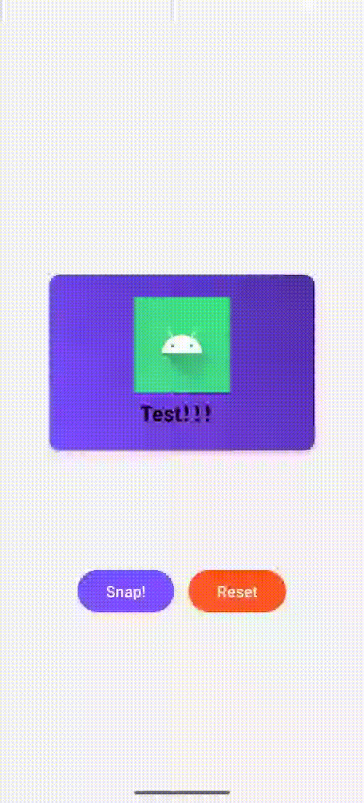

# ThanosEffect

一个实现粒子消散效果的 Android 自定义视图，可以让目标视图优雅地分解成粒子并逐渐消失。

[English Version](README_EN.md)



## 特性

- 从左到右的渐进式粒子化效果
- 平滑的消散动画
- 可自定义的粒子大小和动画参数
- 支持任意 View 的消散效果
- 高性能的渲染实现
- 流畅的粒子运动轨迹

## 使用方法

1. 在布局文件中使用 ThanosDisintegrationView：

```xml
<tech.hezy.thanoseffect.ThanosDisintegrationView
    android:id="@+id/thanosView"
    android:layout_width="wrap_content"
    android:layout_height="wrap_content">
    
    <!-- 将需要应用消散效果的 View 放在这里 -->
    <ImageView
        android:layout_width="wrap_content"
        android:layout_height="wrap_content"
        android:src="@drawable/your_image"/>
        
</tech.hezy.thanoseffect.ThanosDisintegrationView>
```

2. 在代码中控制动画：

```kotlin
// 开始消散动画
thanosView.startDisintegration()

// 重置视图
thanosView.reset()
```

## 自定义属性

```xml
<declare-styleable name="ThanosDisintegrationView">
    <!-- 粒子网格的行数 -->
    <attr name="gridRows" format="integer"/>
    <!-- 粒子网格的列数 -->
    <attr name="gridCols" format="integer"/>
    <!-- 动画持续时间（毫秒） -->
    <attr name="durationMillis" format="integer"/>
    <!-- 粒子之间的间隔（像素） -->
    <attr name="gapPx" format="dimension"/>
</declare-styleable>
```

## 实现细节

- 使用 Canvas 和 Bitmap 进行高效绘制
- 采用粒子系统实现消散效果
- 支持渐变遮罩实现平滑过渡
- 优化的内存使用和性能表现

## 性能优化

- 使用离屏缓存减少绘制开销
- 智能的粒子管理系统
- 优化的动画计算逻辑
- 及时回收不需要的资源

